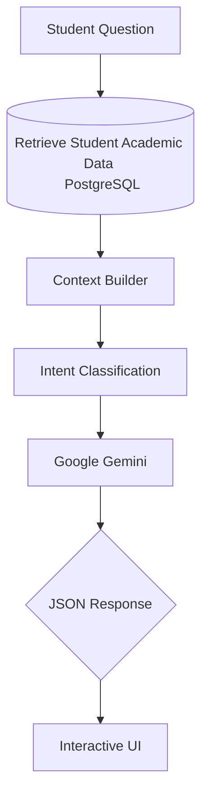

  <h1>🎓 Sanfoor — AI-Powered Academic Advising Platform</h1>
  
<em>An AI-native academic advising platform that helps university students make smarter academic decisions through personalized AI recommendations, interactive curriculum planning, and intelligent course registration assistance.</em>

---

## 🚀 Overview

Sanfoor is an AI-powered academic advising platform designed to solve one of the biggest challenges faced by universities: providing personalized academic guidance to thousands of students while reducing the workload of academic advisors.

Instead of relying on long queues, manual advising sessions, or unofficial recommendations, students receive **instant, context-aware academic guidance** based on their real academic records.

The platform combines visual curriculum planning, AI-powered academic advising, trial registration, and intelligent recommendation systems into a single unified experience.

## ✨ Key Features

### 🤖 AI Academic Advisor
An intelligent academic advisor powered by **Google Gemini** and **Structured Retrieval-Augmented Generation (Structured RAG)**.

The advisor understands:
- **Student GPA**
- **Completed courses**
- **Degree requirements**
- **Current registration cart**
- **Prerequisite chains**
- **Course difficulty**
- **Academic warning status**
- **Credit hour regulations**

*It provides personalized recommendations instead of generic chatbot responses.*

### 🌳 Interactive Curriculum Tree
Students can visualize their entire study plan using an interactive prerequisite tree.

Each course is displayed as:
- ✅ **Completed**
- 🔵 **Available**
- 🔒 **Locked**

*allowing students to easily understand prerequisite relationships.*

### 🛒 Trial Registration
Students can simulate course registration before the official university registration period.

The AI can analyze the trial schedule and recommend:
- Better course combinations
- Balanced workload
- GPA-friendly schedules
- Graduation optimization

### 💬 Interactive AI Widgets
Instead of returning plain text, the AI generates structured JSON responses that power interactive UI components, including:
- Course recommendation cards
- Cart review
- Course comparison
- Credit-hour slider
- Follow-up suggestions
- Interactive action buttons

### 📊 Academic Analytics
The platform provides intelligent academic insights such as:
- Course demand analysis
- Curriculum visualization
- Student progress tracking
- Academic workload analysis

## 🧠 AI Architecture

Sanfoor uses a **Structured Retrieval-Augmented Generation (Structured RAG)** architecture.

> Unlike traditional chatbots, Sanfoor retrieves real academic information before generating recommendations.

## 🛠 Tech Stack

### Backend
- **Laravel 12**
- **PHP 8.2**

### Frontend
- **React**
- **Inertia.js**
- **Vite**
- **Tailwind CSS**

### Database
- **PostgreSQL**

### AI
- **Google Gemini API**
- **Structured RAG**
- **Prompt Engineering**
- **Intent Classification**

### Visualization
- **React Flow**
- **Mermaid**

### Deployment
- **Linux**
- **Nginx**
- **PHP-FPM**

## 🎯 Vision

To become the next generation AI-powered academic advising platform for universities by transforming academic planning from a manual process into an intelligent, personalized experience.
