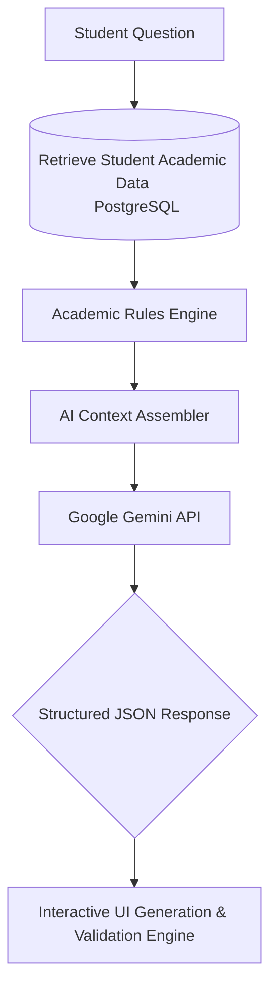

  <h1>🎓 Sanfoor — AI-Powered Academic Advising Platform</h1>
  
<em>An AI-native academic advising platform that helps university students make smarter academic decisions through personalized AI recommendations, interactive curriculum planning, and intelligent course registration assistance.</em>

---

## 🚀 Overview

Sanfoor is a comprehensive educational platform designed to solve a critical challenge faced by universities: providing highly personalized academic guidance to students while reducing the workload on human advisors.

Built with modern web technologies, Sanfoor introduces a data-driven approach to educational planning. Instead of relying on manual advising sessions or static portals, students receive **instant, context-aware academic guidance** powered by real-time data from their academic records.

The platform unifies visual curriculum planning, AI-powered advising, trial registration simulations, and recommendation systems into a single cohesive ecosystem.

## ✨ Key Features

### 🤖 AI Academic Advisor
An intelligent academic advisor powered by **Google Gemini** and a custom **Structured Retrieval-Augmented Generation (Structured RAG)** pipeline.

The advisor natively processes:
- **Student GPA & Performance**
- **Completed Courses & Milestones**
- **Degree Requirements**
- **Current Trial Registration Cart**
- **Prerequisite Chains**
- **Course Difficulty & Workload**
- **Academic Warning Statuses**
- **University Credit Hour Regulations**

*It provides rule-bound, personalized recommendations directly grounded in the student's actual database records.*

### 🌳 Interactive Curriculum Tree
Students can visualize their entire study plan using a modern, interactive prerequisite tree (built with ReactFlow).

Each course is dynamically displayed as:
- ✅ **Completed**
- 🔵 **Available**
- 🔒 **Locked**

*allowing students to instantly decode complex prerequisite relationships at a glance.*

### 🛒 Trial Registration & Simulation
Students can simulate course registration before the official university registration period begins.

The AI analyzes the trial schedule and actively recommends:
- Optimized course combinations
- Balanced academic workloads
- GPA-friendly schedules to prevent academic probation
- Adjustments to respect maximum credit hour limits

### 💬 Interactive AI Widgets
Moving beyond plain text, the AI generates structured JSON responses that power interactive UI components, including:
- Course recommendation cards (with 1-Click "Add to Cart" buttons)
- Real-time cart reviews
- Side-by-side course comparisons
- Dynamic credit-hour sliders
- Contextual follow-up suggestions

### 📊 Academic Analytics
The platform aggregates student registration data to provide universities with intelligent academic insights:
- Demand forecasting for courses based on student trial carts
- Real-time student progress tracking
- Feedback evaluation and AI usage metrics

## 🧠 AI Architecture

Sanfoor utilizes a highly structured **Retrieval-Augmented Generation (RAG)** pipeline designed to minimize hallucinations by strictly grounding the AI in database facts.

> By retrieving and validating real academic data against university rules *before* and *after* generating recommendations, Sanfoor significantly reduces AI hallucinations.

## 🛠 Tech Stack

### Backend
- **Laravel 12**
- **PHP 8.2**

### Frontend
- **React**
- **Inertia.js**
- **Vite**
- **Tailwind CSS**

### Database
- **PostgreSQL**

### AI & Logic Engines
- **Google Gemini API**
- **Structured RAG**
- **Validation Engine** (Overflow & Hallucination Checks)
- **Course Ranking Engine**

### Visualization
- **React Flow**
- **Mermaid**

## 🎯 Vision

Our vision is to build a reliable standard for AI-powered academic advising, transforming academic planning from a manual, error-prone process into an intelligent, data-driven, and highly personalized student experience.
